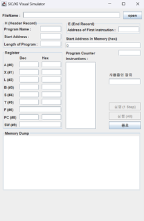
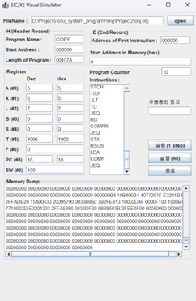
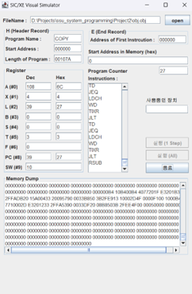

# SSU System Programming

2024 1학기

## Project 1

SIC/XE 소스코드를 object program으로 변환하는 어셈블러 구현하기 

- (a) C로 구현
- (b) Java로 구현

## Project 2

SIC/XE 시뮬레이터 개발

- GUI (Java Swing)
- Loader
- Resource Manager (Memory, Register)
- Instruction Executor

| 초기 화면 | 실행중 화면 | 실행 완료 화면 |
|-------|--------|----------|
||||
